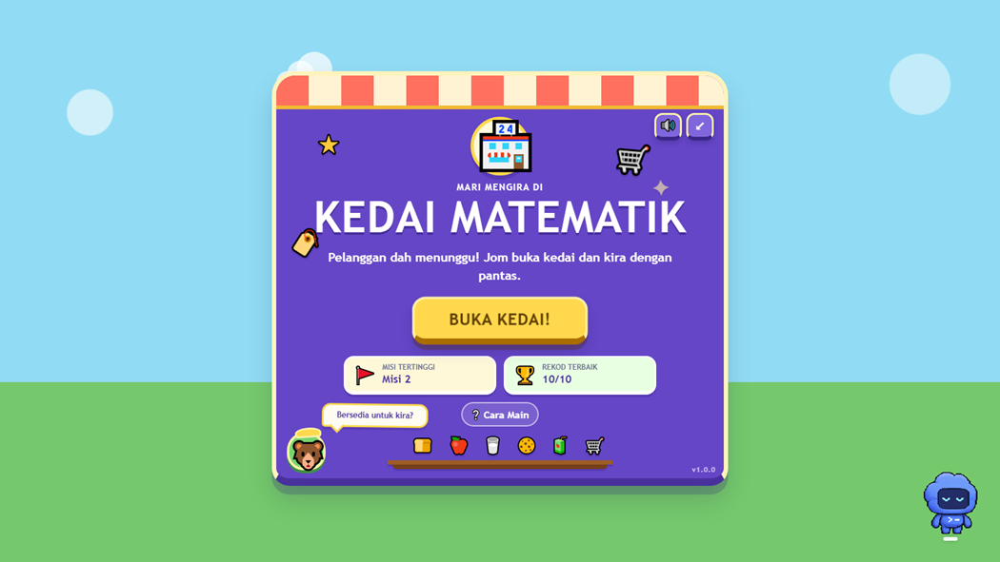
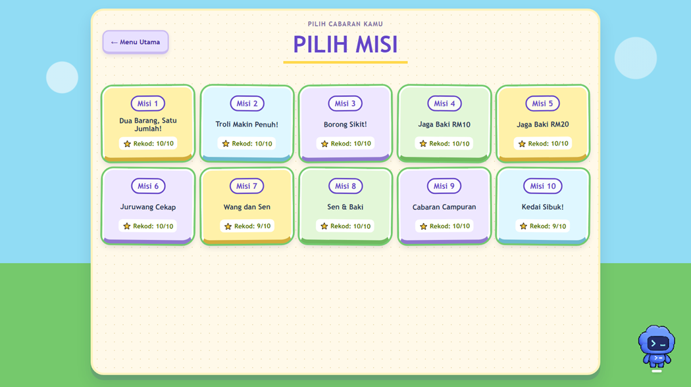
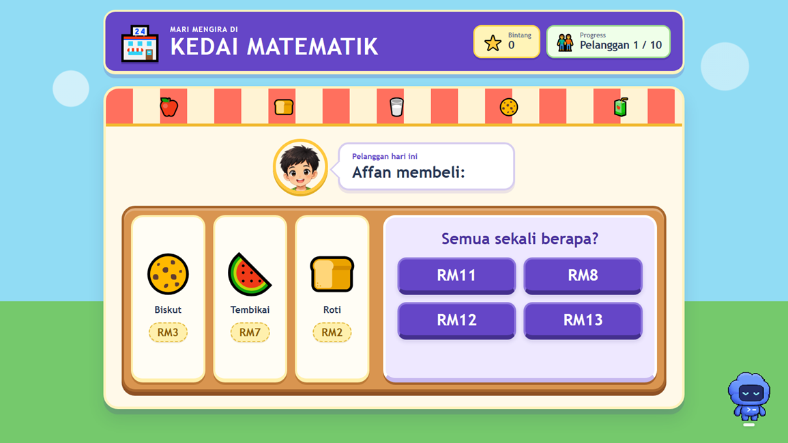

# Kedai Matematik 🏪➕⭐

Game pendidikan matematik kanak-kanak berasaskan web.

Pemain membantu pelanggan di sebuah kedai dengan mengira harga barang, kuantiti, wang, sen dan baki.

## 🎮 Main Sekarang

https://zilelsaif.github.io/kedai-matematik/

## ✨ Ciri-ciri

- 10 misi dengan tahap kesukaran berperingkat
- Tambah harga 2 dan 3 barang
- Pengiraan kuantiti barang
- Kira baki RM10 dan RM20
- Wang Ringgit dan sen
- Cabaran campuran
- Misi akhir dengan had masa
- 10 watak pelanggan
- Animasi pelanggan
- Sound effects
- Fullscreen
- Progress dan skor terbaik disimpan dalam browser
- Sesuai untuk desktop dan tablet landscape

## 🧮 Misi

1. Dua Barang, Satu Jumlah!
2. Troli Makin Penuh!
3. Borong Sikit!
4. Jaga Baki RM10
5. Jaga Baki RM20
6. Juruwang Cekap
7. Wang dan Sen
8. Sen & Baki
9. Cabaran Campuran
10. Kedai Sibuk!

## 🛠️ Teknologi

- HTML
- CSS
- Vanilla JavaScript
- Tiada framework
- Tiada backend

## 💾 Penyimpanan Progress

Progress permainan disimpan menggunakan `localStorage` pada browser pemain.

Tiada akaun atau pendaftaran diperlukan.

## 📱 Platform

Game direka untuk:

- Desktop
- Laptop
- Tablet landscape

## 📸 Screenshot

### Menu Utama

### Pilih Misi

### Gameplay

## 📦 Versi

**v1.2.0**

## 👨‍💻 Pembangunan

Dibangunkan oleh Zil-el-Saif sebagai projek game pendidikan kanak-kanak menggunakan Codex sebagai pembantu pembangunan.
